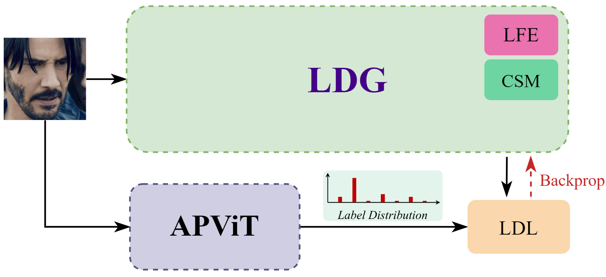
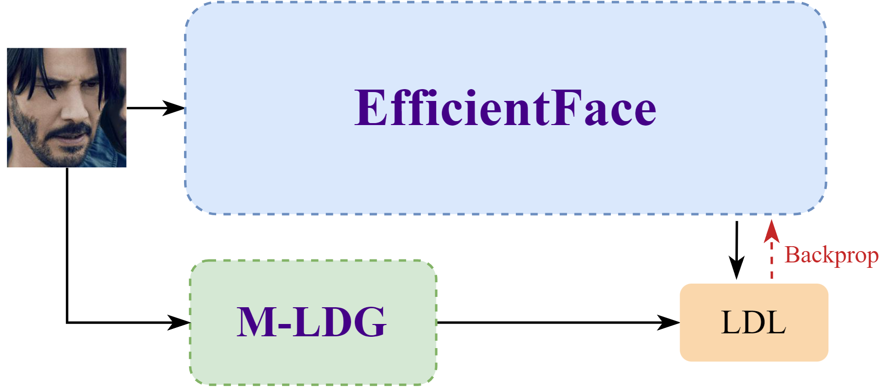

# FER MLDG: Enhancing label distribution generation for lightweight facial expression recognition with local-global features and transformer guidance

**Authors:** David Valverde Garro, Luis Alexander Calvo Valverde  
**Institution:** Tecnological Institute of Costa Rica (TEC)

## Abstract

This repository accompanies a master's thesis on lightweight facial expression recognition (FER) for resource-constrained environments. While high-accuracy models such as [APViT](https://github.com/youqingxiaozhua/APViT) achieve strong results on in-the-wild datasets like [AffectNet](https://mohammadmahoor.com/pages/databases/affectnet/), their computational cost limits deployment on mobile and edge devices; lightweight networks such as [EfficientFace](https://github.com/zengqunzhao/EfficientFace) offer efficiency but lag in accuracy. The project addresses this gap through a two-stage label distribution learning pipeline: a modified Label Distribution Generator (M-LDG), enhanced with APViT transformer guidance, pretrained backbone weights, and EfficientFace local–global feature modules, produces soft labels that guide EfficientFace training. The codebase implements both experimental phases—M-LDG training (Phase 1) and EfficientFace fine-tuning with APViT or M-LDG as the label generator (Phase 2)—along with dataset preprocessing and visualization utilities.

## Proposed pipeline

### Phase I — Modified LDG training

The IR-50 backbone is initialized with APViT weights, enhanced with EfficientFace local–global modules, and trained with APViT as the label-distribution teacher.



### Phase II — EfficientFace fine-tuning

The trained M-LDG (or APViT) generates soft labels used to train EfficientFace on AffectNet.



## Results

Cross-phase accuracy progression on AffectNet-7 and AffectNet-8 (accuracy in %). Published baselines and an APViT model trained from scratch are included for reference.


| Stage                                     | AffectNet-7 | AffectNet-8 |
| ----------------------------------------- | ----------- | ----------- |
| M-LDG baseline (C=False, ablation)        | 55.51       | 49.24       |
| M-LDG + APViT guidance (C=True, ablation) | 63.31       | 57.06       |
| M-LDG (Phase I optimized)                 | 64.34       | 57.71       |
| EfficientFace guided by M-LDG (Phase II)  | 63.00       | 55.99       |
| EfficientFace guided by APViT (Phase II)  | 62.31       | 56.11       |
| Published EfficientFace                   | 63.70       | 59.89       |
| Published APViT                           | 66.91       | —           |
| APViT trained from scratch                | 64.2        | 57.31       |


## Repository layout


| Path | Description |
|------|-------------|
| `src/` | Main training codebase. Phase 2 entry point is `src/main.py`; see `src/README.md` for setup and run instructions. |
| `src/networks/LDG/` | **Phase 1** — modified Label Distribution Generator (mLDG) training on AffectNet. See `src/networks/LDG/README.md`. |
| `src/networks/APViT/` | APViT submodule (git submodule). Transformer-based label generator and baseline. |
| `src/networks/EfficientFace/` | EfficientFace submodule (git submodule). Lightweight FER backbone fine-tuned in Phase 2. |
| `src/preproc/` | AffectNet preprocessing — face alignment and ImageFolder layout for training. |
| `src/visualization/` | Class Activation Map (CAM) tooling for EfficientFace and mLDG checkpoints. See `src/visualization/README.md`. |
| `src/data_analysis/` | R scripts and raw CSV exports for Phase 1 and Phase 2 experiment analysis. |
| `src/metrics/` | Model complexity and evaluation metric utilities (`compute_metrics.py`, `model_complexity.py`). |
| `latex/` | LaTeX sources for the thesis proposal and dissertation. |

## Upstream resources

| Resource | Link |
|----------|------|
| APViT | [github.com/youqingxiaozhua/APViT](https://github.com/youqingxiaozhua/APViT) |
| EfficientFace | [github.com/zengqunzhao/EfficientFace](https://github.com/zengqunzhao/EfficientFace) |
| AffectNet | [mohammadmahoor.com/pages/databases/affectnet](https://mohammadmahoor.com/pages/databases/affectnet/) |

### Getting started

1. Clone the repository and initialize submodules from the repo root:
  ```bash
   git submodule init
   git submodule update
  ```
2. Choose the pipeline you need:
  - **Phase 1 (mLDG training)** — follow `src/networks/LDG/README.md`.
  - **Phase 2 (EfficientFace fine-tuning)** — follow `src/README.md`.
  - **CAM visualization** — follow `src/visualization/README.md`.

Both training phases require Python 3.10, PyTorch 1.11 (CUDA), and a CUDA-capable GPU. Pretrained weight files and the AffectNet dataset are not tracked in git; each phase README lists the expected paths and filenames.